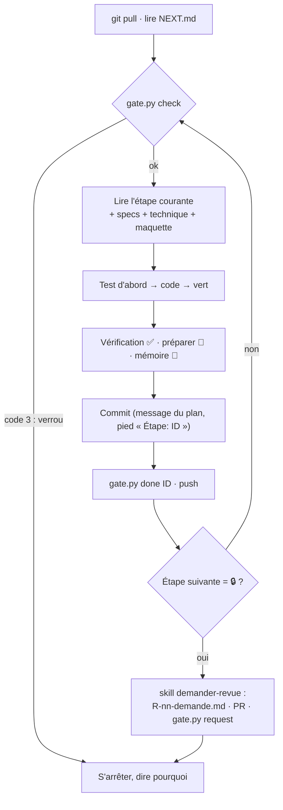

# Plan d'implémentation — InfraFlowSculptor v1

Ce dossier dit **dans quel ordre construire** et **comment vérifier** chaque étape. Il ne redéfinit ni le
fonctionnel ([`../specs/`](../specs/README.md)) ni l'architecture ([`../technique/`](../technique/README.md)) :
il s'y réfère par leurs identifiants.

| Vous cherchez… | Lisez |
|---|---|
| **Où on en est, quoi faire maintenant** | [`../../NEXT.md`](../../NEXT.md) — à la racine |
| Les étapes, dans l'ordre | Les fichiers numérotés ci-dessous |
| Pourquoi c'est construit ainsi | [`../technique/`](../technique/README.md) |
| À quoi ressemble chaque écran | [`../design/`](../design/README.md) |
| Ce qui a été fait, quand | [`JOURNAL.md`](JOURNAL.md) |
| Les revues de Claude | [`revues/`](revues/README.md) |
| Les tests manuels à faire et leurs résultats | [`recettes/`](recettes/README.md) |

## Qui fait quoi

| Acteur | Rôle | Ne fait jamais |
|---|---|---|
| **Claude (Opus)** | Conçoit : specs, technique, plan, maquettes. **Relit** à chaque verrou 🔒, rend un verdict, détaille le jalon suivant. | Écrire le code de production. |
| **Luna (Codex)** | **Exécute** le plan étape par étape : tests d'abord, code, vérification, mémoire, commit, `NEXT.md`. Prépare les tests manuels. | Prendre une décision de conception ; franchir un verrou ; modifier `docs/specs/`, `docs/technique/` ou le texte du plan. |
| **Vous** | Lancez Luna et Claude, exécutez les tests manuels 🧪 et les recettes, faites ce qui touche à vos comptes (Azure, Azure DevOps, Entra), fusionnez les pull requests. | — |

## Les phases

| Fichier | Phase | Étapes | Verrous | Détail |
|---|---|---|---|---|
| [`00-socle.md`](00-socle.md) | **S — Socle technique** : dépôt, backend depuis le template CQRS, Aspire et émulateurs, Angular depuis le template, design system, CI | `S-01` → `S-17` | `R-01` | Exécutable |
| [`01-preuves.md`](01-preuves.md) | **P — Preuves** P1–P5, P7–P9 ([04 § 7.2](../specs/04-perimetre-et-lots.md)) : sortie de référence du pilote écrite à la main et déployée sur Azure | `P-01` → `P-08` | `R-02`, `R-03` | Exécutable |
| [`02-jalon-0-pilote.md`](02-jalon-0-pilote.md) | **J0 — Pilote** ([04 § 2.0](../specs/04-perimetre-et-lots.md)) | `J0-01` → `J0-32` | `R-04` → `R-08` | Exécutable |
| [`03-jalon-1-tranche-verticale.md`](03-jalon-1-tranche-verticale.md) | **J1 — Tranche verticale** : projet de référence complet | `J1-01` → … | `R-09` → `R-12` | Découpé ; détaillé au verrou `R-08` |
| [`04-jalon-2-largeur.md`](04-jalon-2-largeur.md) | **J2 — Largeur** | `J2-01` → … | `R-13` → `R-15` | Découpé ; détaillé au verrou `R-12` |
| [`05-jalon-3-outillage.md`](05-jalon-3-outillage.md) | **J3 — Outillage** : MCP, graphe, recherche, import JSON, démonstration | `J3-01` → … | `R-16` → `R-18` | Découpé ; détaillé au verrou `R-15` |
| [`06-lots-2-a-4.md`](06-lots-2-a-4.md) | **Lots 2, 3, 4** | — | — | **Grossier, volontairement** |

**Pourquoi les jalons suivants ne sont pas encore détaillés au fichier près.** Une étape exécutable sans
décision cite des fichiers, des classes et des commandes qui n'existeront qu'après les étapes précédentes.
Les écrire maintenant, c'est écrire des étapes qu'on réécrira. Chaque jalon est donc **découpé** dès
aujourd'hui (objectif, contenu, références, tests, recette), et **détaillé au niveau d'exécution par Claude
au verrou qui le précède**, sur le code réel. Luna ne commence jamais une étape qui n'est pas au niveau
d'exécution : `gate.py lint` refuse une étape sans ses rubriques 🔧 ✅ 🧪.

## Anatomie d'une étape

```markdown
### J0-12 — Titre

| | |
|---|---|
| **Spécifications** | liens vers RG / UC / DEC |
| **Maquette** | preview/<Écran>.html — zones à implémenter / zones exclues (jalon ultérieur) |
| **Dépend de** | étapes |
| **Commit** | `type(portée): résumé` |

🎯 **Objectif.**  Ce que l'étape rend possible.
🔧 **À faire.**   Liste numérotée, fichiers et noms exacts.
✅ **Vérification automatique.**  Commandes et résultat attendu.
🧪 **Test manuel.**  Ce que vous faites de vos mains et ce que vous devez voir.
🧠 **Mémoire.**  Fichiers de `.github/memory/` à mettre à jour.
📌 **Hors dépôt.**  État externe à consigner dans `NEXT.md` (Azure, Entra, Azure DevOps…), s'il y en a.
```

## Le cycle de Luna

Skill : [`.agents/skills/executer-etape/SKILL.md`](../../.agents/skills/executer-etape/SKILL.md).



## Les verrous 🔒

Un verrou `R-nn` est une étape du plan où **Luna s'arrête** et où **Claude (Opus) relit** tout ce qui a été
fait depuis le verrou précédent.

1. **Luna** écrit `docs/plan/revues/R-nn-demande.md` (modèle dans [`revues/README.md`](revues/README.md)) :
   étapes couvertes, commits, résultats des vérifications, écarts au plan, captures, tests manuels prêts.
   Elle pousse la branche, ouvre la pull request du segment vers `main`, exécute
   `python tools/plan/gate.py request R-nn` et **s'arrête**. Le statut de `NEXT.md` devient
   `EN_ATTENTE_DE_REVUE`.
2. **Pendant la revue**, `gate.py check` renvoie le code 3 et le crochet git `pre-commit` refuse tout commit
   hors de `docs/`, `NEXT.md` et de la mémoire. Une nouvelle session de Luna lit `NEXT.md` et s'arrête.
3. **Vous** exécutez la recette du segment ([`recettes/`](recettes/README.md)) et consignez le résultat dans
   [`recettes/suivi.md`](recettes/suivi.md).
4. **Claude** applique [`.claude/skills/revue-verrou/SKILL.md`](../../.claude/skills/revue-verrou/SKILL.md) :
   relit le diff du segment, relance les vérifications, confronte au plan, aux specs et aux maquettes,
   vérifie la recette, écrit `docs/plan/revues/R-nn-revue.md` avec un verdict :
   - `Verdict : APPROUVÉ` → `gate.py approve R-nn --by Claude` ; vous fusionnez la pull request ; Luna repart
     de `main` sur la branche du segment suivant.
   - `Verdict : CORRECTIONS` → corrections numérotées `R-nn-C1…` dans la revue, `gate.py reject R-nn` ;
     Luna les applique ([`appliquer-corrections`](../../.agents/skills/appliquer-corrections/SKILL.md)), puis
     redemande la revue.
5. Au verrou qui clôt un jalon, Claude **détaille le jalon suivant** au niveau d'exécution
   ([`.claude/skills/detailler-jalon/SKILL.md`](../../.claude/skills/detailler-jalon/SKILL.md)) avant d'approuver.

Le verrou ne repose pas sur la seule bonne volonté : `gate.py` est exécuté au début de chaque session de
Luna, par le crochet git, et par la CI ([`plan-gate.yml`](../../.github/workflows/plan-gate.yml)) qui
refuse un `NEXT.md` positionné après un verrou non approuvé.

## Branches et pull requests

- Un **segment** = les étapes entre deux verrous. Une branche par segment : `impl/<segment>` (nom donné par
  le verrou précédent ; le premier est `impl/socle`), créée depuis `origin/main` à jour.
- **Un commit par étape**, message du plan, en français, pied obligatoire :

  ```
  feat(moteur): calculer les noms Azure par gabarit

  Étape: J0-10
  ```
- Push après chaque étape (le travail sur plusieurs machines ne doit rien perdre).
- Au verrou : une pull request `impl/<segment>` → `main`, titre `[R-nn] <titre du verrou>`, description =
  la demande de revue. Vous seul fusionnez.

## `NEXT.md`

`NEXT.md` est **court** : l'étape courante, son statut, la suivante, le verrou, l'état hors dépôt (📌), les
tests manuels en attente, les questions pour Claude. Il ne contient ni l'historique (→ [`JOURNAL.md`](JOURNAL.md),
écrit par `gate.py`), ni le détail des étapes (→ ce dossier). S'il dépasse deux écrans, du détail y est
descendu qui appartenait ailleurs.

Les lignes du tableau « En un coup d'œil » sont lues et écrites par `gate.py` ; ne pas renommer leurs
libellés.

## Quand le plan ne suffit pas

Luna ne tranche rien. Si une étape :
- contredit le code réel (nom de fichier, signature) → suivre le code réel **en restant fidèle à
  l'intention**, et noter l'écart pour la demande de revue ;
- contredit une spec, ou exige un choix non écrit (règle métier, sécurité, données personnelles, nouvelle
  dépendance, nouveau service Azure) → **s'arrêter** : statut `BLOQUE`, question écrite dans la section
  « Questions pour Claude » de `NEXT.md`, commit `chore(plan): question sur <ID>`, push. Vous transmettez
  à Claude, qui répond en modifiant le plan ou la technique, puis remet le statut à `A_FAIRE`.
- dépend d'une version de paquet introuvable → règle de [DT-03](../technique/01-decisions.md#dt-03--versions-épinglées).

## Les tests manuels

Chaque étape a son 🧪 ; chaque segment a sa **recette** (enchaînement des 🧪 du segment, plus un parcours de
bout en bout) dans [`recettes/`](recettes/README.md). Ils sont écrits pour être faits par vous, seul, avec les
utilisateurs de démonstration ([technique 05 § 3](../technique/05-execution-locale.md#3-utilisateurs-de-démonstration-royaume-keycloak-ifs)).
Chaque test dit : prérequis, actions numérotées, résultat attendu, et quoi noter si ce n'est pas le cas.
