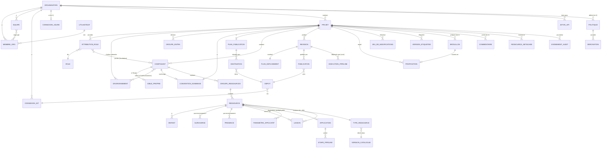

# 05 — Modèle de données (vue conceptuelle)

> Vue d'ensemble des entités du produit et de leurs relations. Les attributs détaillés et les règles sont
> dans les documents de domaine cités. Ce n'est pas un schéma de base de données.

## 1. Diagramme

## 2. Entités

| Entité | Rôle | Document |
|---|---|---|
| Organisation, Membre, Équipe, Rôle, Attribution de rôle, Jeton d'API | Accès et isolation | [10](10-organisations-et-acces.md) |
| Connexion git, Connexion Azure | Accès aux outils du client, au niveau organisation | [24](24-depots-et-publication.md), [13](13-nommage.md) |
| Projet, Environnement, Groupe Entra | Périmètre, chaîne de promotion, principaux humains | [11](11-projets-et-environnements.md), [16](16-liaisons-identites-et-acces.md) |
| Convention de nommage | Gabarits et abréviations (projet, surcharge composant) | [13](13-nommage.md) |
| Composant, Cible propre, Groupe de ressources | Unités de déploiement | [12](12-composants-et-groupes-de-ressources.md) |
| Ressource, Enfant, Surcharge, Présence | Modèle Azure | [14](14-modele-des-ressources.md) |
| Type de ressource, Version du catalogue | Descripteurs | [15](15-catalogue.md) |
| Liaison | Toute relation entre ressources | [16](16-liaisons-identites-et-acces.md) |
| Paramètre applicatif | Configuration des applications | [17](17-parametres-applicatifs-et-secrets.md) |
| Application, Étape de pipeline | Build, qualité, déploiement | [19](19-applications-build-et-deploiement.md) |
| Révision, Plan de déploiement | Production immuable | [21](21-generation-et-revisions.md) |
| Plan de publication, Destination, Dépôt, Publication | Livraison dans git | [24](24-depots-et-publication.md) |
| Exécution de pipeline, Ressource détachée | Suivi des déploiements | [28](28-suivi-des-deploiements.md) |
| Proposition | Modifications à relire | [25](25-agent-ia-mcp.md) |
| Jeu de modifications, Version étiquetée, Brouillon | Historique du modèle | [31](31-historique-et-versions.md) |
| Politique, Dérogation | Gouvernance | [33](33-gouvernance-couts-et-supervision.md) |
| Commentaire | Collaboration | [DEC-76](03-decisions.md) |
| Événement d'audit | Traçabilité | [10 § 8](10-organisations-et-acces.md) |

## 3. Invariants transverses

**RG-DON-01 — Appartenance unique.** Tout objet appartient à exactement une organisation ; tout objet du
modèle appartient à exactement un projet.

**RG-DON-02 — Identifiants.** Tout objet a un identifiant immuable. Les références entre objets passent par
les identifiants, jamais par un nom ou un code ([DEC-08](03-decisions.md)). Les codes (projet,
environnement, composant) servent aux noms Azure, aux dossiers et aux pipelines ; ils sont verrouillés
après la première publication ([RG-PRJ-01](11-projets-et-environnements.md)).

**RG-DON-03 — Données par environnement.** Les surcharges, présences, valeurs de paramètres, identifiants de
ressources existantes et identifiants de groupes Entra sont rattachés à l'identifiant d'un environnement
(ou d'une cible propre). Supprimer l'environnement les supprime.

**RG-DON-04 — Immutabilité.** Révisions, publications, événements d'exécution lus (rapports de release,
changements d'état d'une exécution) et événements d'audit ne sont jamais modifiés. L'état courant d'une
exécution ou d'une cible (« en cours », « déployée », « partiellement appliquée ») est **calculé** à partir de
ces événements.

**RG-DON-05 — Versions.** Chaque objet modifiable porte une version de concurrence ([DEC-37](03-decisions.md)) ;
le projet porte en plus une version de modèle, incrémentée à chaque modification de l'un de ses objets,
qui sert à détecter les révisions périmées.

**RG-DON-06 — Ce qu'IFS ne stocke pas.** Aucune valeur de secret applicatif, aucun mot de passe
d'administration, aucun état Terraform ou Pulumi. Les seules données lues dans les abonnements Azure, par la
connexion Azure en lecture de l'organisation, sont : l'import ([29](29-import.md)) ; la disponibilité des
noms ; la sélection de ressources existantes ; l'usage et les quotas de modèles d'IA ([RG-IA-02](32-ia-et-foundry.md)).
Elles sont mises en cache 24 heures au plus, datées à l'écran, et jamais conservées au-delà.
