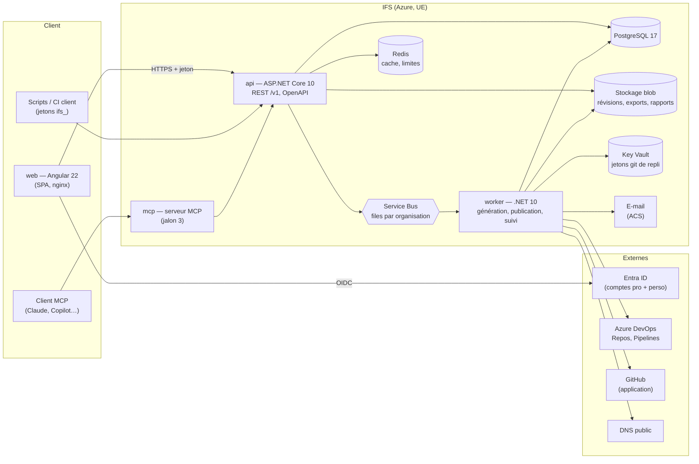
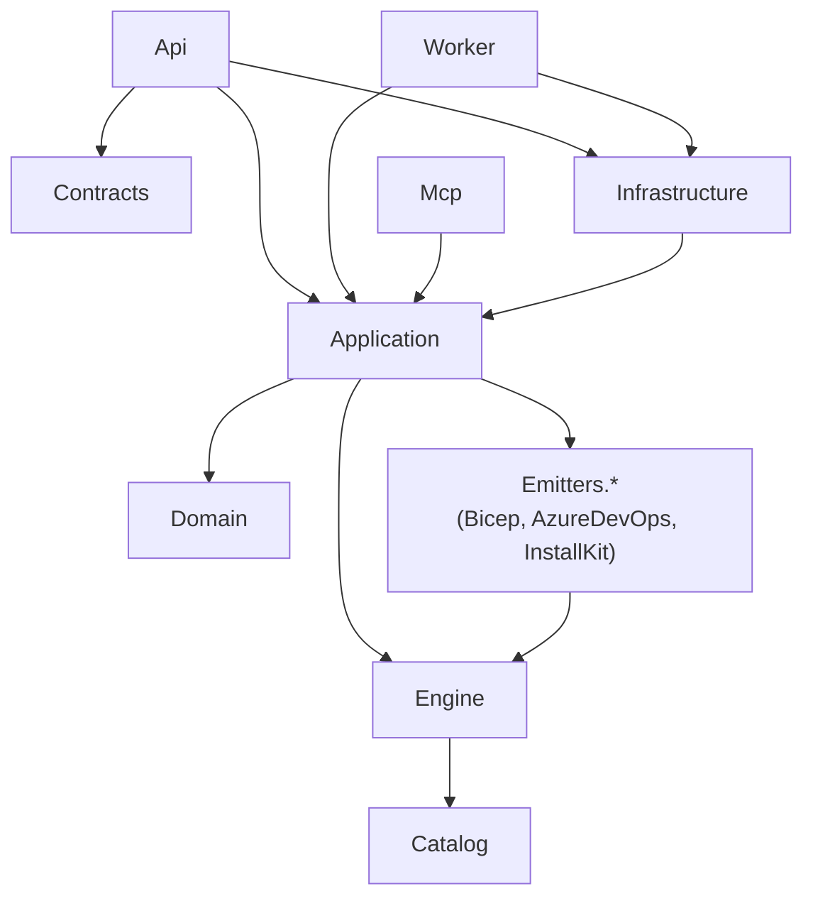
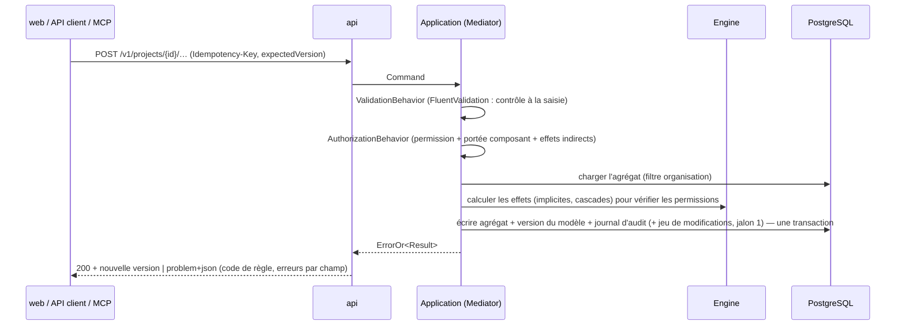

# 00 — Vue d'ensemble

## 1. Les processus



| Processus | Projet .NET / dossier | Rôle | Hébergement Azure |
|---|---|---|---|
| `api` | `src/backend/InfraFlowSculptor.Api` | API REST `/v1`, commandes et requêtes, validation à la saisie, autorisation, mise en file des travaux longs | Container App |
| `worker` | `src/backend/InfraFlowSculptor.Worker` | Travaux longs et planifiés : génération et contrôle de sortie, préparation et écriture des publications, lecture des plateformes CI, e-mails, purges | Container App (sans ingress) |
| `web` | `src/frontend/ifs-web` | Interface Angular, servie statiquement ; `config.json` injecté au démarrage du conteneur | Container App (nginx) |
| `mcp` | `src/backend/InfraFlowSculptor.Mcp` | Serveur MCP (jalon 3), dérivé du catalogue de commandes de l'API | Container App |

Le découpage api / worker est imposé par trois exigences : une génération de 300 ressources peut prendre
jusqu'à 30 s avec le contrôle de sortie ([EXG-07](../specs/27-exigences-non-fonctionnelles.md)) ; les
générations et publications passent par des **files par organisation servies équitablement**
([EXG-23](../specs/27-exigences-non-fonctionnelles.md)) ; le suivi des déploiements lit Azure DevOps toutes
les 2 à 15 minutes ([RG-SUI-01](../specs/28-suivi-des-deploiements.md)).

## 2. Les bibliothèques



| Projet | Contenu | Dépendances interdites |
|---|---|---|
| `InfraFlowSculptor.Domain` | Agrégats (organisation, projet, composant, ressource…), objets valeur, erreurs `ErrorOr`, invariants simples | Tout sauf `ErrorOr` |
| `InfraFlowSculptor.Catalog` | Descripteurs JSON des types et des étapes, versions figées, schéma, chargeur | EF, ASP.NET, Azure SDK |
| `InfraFlowSculptor.Engine` | **Étage 1** : nommage, valeurs effectives, tags, câblage implicite, attributions, ordre des composants, validation (constats), **plan de déploiement** | EF, ASP.NET, Azure SDK, accès fichier/réseau |
| `InfraFlowSculptor.Emitters.Bicep` | **Étage 2** : plan → fichiers Bicep | Engine interne autre que le modèle du plan (lit `DeploymentPlan` uniquement) |
| `InfraFlowSculptor.Emitters.AzureDevOps` | Étage 2 : plan → pipelines YAML Azure DevOps et modèles partagés | Idem |
| `InfraFlowSculptor.Emitters.InstallKit` | Étage 2 : plan → kit d'installation (script Azure, pipeline d'installation, `SETUP.md`) | Idem |
| `InfraFlowSculptor.Application` | Tranches CQRS (`Mediator`) : commandes, requêtes, validateurs, interfaces des ports | EF concret, SDK Azure concrets |
| `InfraFlowSculptor.Infrastructure` | EF Core / PostgreSQL, blob, Service Bus, Redis, e-mail, fournisseurs git, Azure DevOps, Key Vault | — |
| `InfraFlowSculptor.Contracts` | DTO publics de l'API (requêtes, réponses) | Domain |
| `InfraFlowSculptor.Api` | Points de terminaison minimal API, authentification, erreurs, OpenAPI | — |
| `InfraFlowSculptor.Worker` | Hôte des travaux (processeurs Service Bus, tâches planifiées) | Api |
| `InfraFlowSculptor.ServiceDefaults` | OpenTelemetry, santé, résilience HTTP, découverte de services (Aspire) | — |
| `InfraFlowSculptor.AppHost` | Orchestration locale Aspire et émulateurs | — |

Les dépendances interdites sont vérifiées par des tests d'architecture
([06 § 3](06-tests-et-qualite.md)). L'émetteur ne lit **que** le plan : c'est la traduction stricte de
[RG-GEN-07](../specs/21-generation-et-revisions.md) et de [DEC-44](../specs/03-decisions.md).

## 3. Les flux principaux

### 3.1 Une commande du modèle



Toute commande qui modifie le modèle incrémente la **version du modèle** du projet
([RG-DON-05](../specs/05-modele-de-donnees.md)). Les constats sont recalculés à la demande et mis en cache
par `(projet, version du modèle, version du catalogue)` ([20 § 2](../specs/20-validation.md)).

### 3.2 Une génération

```mermaid
sequenceDiagram
  participant API as api
  participant SB as Service Bus (session = organisation)
  participant W as worker
  participant ENG as Engine
  participant EM as Émetteurs
  participant BLOB as Blob
  participant DB as PostgreSQL
  API->>DB: refuser si erreur de validation ; sinon créer la révision « en file »
  API->>SB: GenerateRevision {revisionId}
  SB->>W: message (sessions servies à tour de rôle)
  W->>ENG: modèle → plan de déploiement
  W->>EM: plan → fichiers (Bicep, Azure DevOps, kit)
  W->>W: contrôles de sortie (bicep build/lint/format, schéma YAML, analyse PowerShell)
  W->>BLOB: fichiers (adressés par empreinte) + archive
  W->>DB: révision « générée » (ou « en échec » + incident)
```

### 3.3 Une publication, puis le suivi

La publication prépare chaque dépôt (lecture de la branche, comparaison au manifeste), présente le
résultat, puis écrit un commit et une pull request par dépôt ([24 § 6](../specs/24-depots-et-publication.md)).
Le suivi lit ensuite les exécutions Azure DevOps des pipelines gérés et leurs artefacts `ifs-report.json`
([28](../specs/28-suivi-des-deploiements.md)). IFS ne déclenche, n'approuve et n'annule jamais un pipeline.

## 4. Arborescence du dépôt

```
/
├── AGENTS.md, CLAUDE.md, MEMORY.md, NEXT.md     consignes des agents, mémoire, état courant
├── docs/
│   ├── specs/          spécifications fonctionnelles (ne pas modifier sans Claude)
│   ├── technique/      ce dossier
│   ├── plan/           plan d'exécution, revues, recettes, journal
│   └── design/         maquette v1 et design system Strata exportés en HTML statique
├── src/
│   ├── backend/        InfraFlowSculptor.slnx et tous les projets .NET
│   └── frontend/
│       └── ifs-web/    application Angular
├── catalog/            descripteurs JSON des types et des étapes, par version (embarqués dans Catalog)
├── reference/          sorties de référence (projet pilote, projet de référence) — font foi pour les émetteurs
├── samples/
│   └── witness-app/    application témoin déployée par les preuves et la recette
├── infra/              infrastructure Azure d'IFS lui-même (Bicep)
├── tools/              scripts : plan (gate.py), design (export), dev (prérequis, données)
├── .github/            mémoire thématique, skills partagées, workflows CI
├── .agents/skills/     skills de Codex (Luna)
└── .claude/skills/     skills de Claude
```
