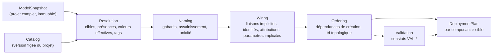

# 03 — Moteur et génération

## 1. Rôle

Le moteur (`InfraFlowSculptor.Engine`) est **l'étage 1** de [21 § 3](../specs/21-generation-et-revisions.md) et
le seul lieu des décisions métier calculées ([DEC-05](../specs/03-decisions.md), [RG-GEN-06](../specs/21-generation-et-revisions.md)).
Les émetteurs (étage 2) ne font que traduire son plan de déploiement.



Chaque bloc est une classe publique sans état (`NamingEngine`, `EffectiveValueResolver`, `WiringEngine`,
`ComponentOrdering`, `ValidationEngine`, `DeploymentPlanBuilder`) et un point d'entrée unique
`EngineFacade.Evaluate(ModelSnapshot, CatalogVersion, EvaluationOptions) → EvaluationResult`. L'API, le worker
et le MCP consomment `EvaluationResult` : noms affichés, constats, implicites et fichiers viennent du **même**
calcul ([P2](../specs/01-principes.md)).

## 2. Catalogue

### 2.1 Arborescence

```
catalog/
├── schema/
│   ├── resource-type.schema.json
│   ├── step.schema.json
│   └── catalog-version.schema.json
├── 2026.10-pilot/                 version du pilote (jalon 0) : types du pilote seulement
│   ├── catalog.json               { version, status, publishedAt, supportEndsAt, notes }
│   ├── regions.json               code Azure → code court (15 § 5)
│   ├── roles.json                 rôles intégrés : nom, identifiant, description, lien doc, groupes d'équivalence
│   ├── pins.json                  modules AVM et versions, CLI Bicep, image de démarrage, Trivy…
│   ├── schemas/azure-pipelines.json   schéma YAML Azure DevOps épinglé (DT-16)
│   ├── types/
│   │   ├── LogAnalyticsWorkspace.json
│   │   ├── ApplicationInsights.json
│   │   ├── KeyVault.json
│   │   ├── UserAssignedIdentity.json
│   │   ├── ContainerRegistry.json
│   │   ├── ContainerAppsEnvironment.json
│   │   ├── ContainerApp.json
│   │   ├── SqlServer.json
│   │   └── SqlDatabase.json
│   └── steps/
│       ├── DependencyCache.json
│       └── ImageScan.json
└── 2026.10/                       version du jalon 1 : les 11 types du projet de référence, puis les 17 au jalon 2
```

Une version au statut `published` ne change plus ; un test calcule l'empreinte de chaque version publiée et
la compare à `catalog/published-hashes.json`.

### 2.2 Un descripteur

Toutes les sections de [15 § 1](../specs/15-catalogue.md), en JSON, noms en anglais. Extrait :

```json
{
  "type": "KeyVault",
  "labels": { "fr": "Key Vault", "en": "Key Vault" },
  "category": "security",
  "armType": "Microsoft.KeyVault/vaults",
  "availableFrom": "lot1",
  "naming": {
    "abbreviation": "kv",
    "allowed": "[a-z0-9-]", "case": "lower",
    "separators": ["-"], "forbidConsecutiveSeparators": true,
    "minLength": 3, "maxLength": 24,
    "firstChar": "[a-z]", "lastChar": "[a-z0-9]",
    "uniqueness": "global", "availabilityDomain": "vault.azure.net"
  },
  "properties": [
    { "name": "sku", "labels": { "fr": "SKU", "en": "SKU" }, "kind": "enum", "values": ["standard", "premium"],
      "default": "standard", "overridable": true },
    { "name": "enablePurgeProtection", "kind": "boolean", "default": true, "overridable": true,
      "irreversible": { "from": false, "to": true } },
    { "name": "softDeleteRetentionInDays", "kind": "integer", "min": 7, "max": 90, "default": 90,
      "lockedAfterPublish": true }
  ],
  "fixedValues": [ { "name": "enableRbacAuthorization", "value": true, "labels": { "fr": "Autorisation RBAC" } } ],
  "identities": { "system": false, "userAssignedMax": 0 },
  "links": { "asSource": [], "asTarget": ["Access", "SecretRead", "Diagnostics"] },
  "outputs": [
    { "name": "vaultUri", "sensitive": false, "computableFromName": true, "pattern": "https://{name}.vault.azure.net/" },
    { "name": "name", "sensitive": false, "computableFromName": true },
    { "name": "id", "sensitive": false, "computableFromName": true }
  ],
  "lifecycle": { "family": "data" },
  "roles": ["Key Vault Administrator", "Key Vault Secrets Officer", "Key Vault Secrets User", "Key Vault Reader"],
  "roleEquivalences": { "SecretRead": ["Key Vault Secrets User", "Key Vault Secrets Officer", "Key Vault Administrator"] },
  "exposure": { "modes": ["Public", "Restricted"], "privateGroupIds": [] },
  "diagnostics": { "supported": true },
  "languageSupport": { "Bicep": "full" },
  "generation": {
    "Bicep": { "module": "br/public:avm/res/key-vault/vault", "versionPin": "keyVault",
      "map": { "sku": "sku", "enablePurgeProtection": "enablePurgeProtection",
               "softDeleteRetentionInDays": "softDeleteRetentionInDays" } }
  }
}
```

Les valeurs (SKU, longueurs, rôles, versions de modules) sont **revérifiées contre la documentation
Microsoft au moment d'écrire chaque descripteur** ([04 § 7.2](../specs/04-perimetre-et-lots.md)) ; l'étape du
plan qui écrit un descripteur donne le lien de la documentation à consulter et exige de citer la date de
vérification dans `catalog.json` (`verifiedAgainstDocsOn`).

## 3. Le modèle d'entrée

`ModelSnapshot` est un graphe immuable (records) construit par l'Application à partir de la base :
projet, environnements, conventions de nommage et de tags, composants (mode, cibles, réglages), groupes de
ressources, ressources (type, propriétés, surcharges par `EnvironmentId`, présences, nom forcé, existante +
identifiants), enfants, identités, liaisons, paramètres applicatifs, applications, plan de publication,
groupes Entra. Il est sérialisable en JSON (format `ifs-project/v1`, [UC-PRJ-07](../specs/11-projets-et-environnements.md)) :
**l'export du projet est la sérialisation de l'instantané**, ce qui garantit que l'import le relit sans perte.

## 4. Plan de déploiement

Contenu exact de [21 § 3.1](../specs/21-generation-et-revisions.md), par `(composant, cible)` :

```csharp
public sealed record DeploymentPlan(
    ProjectInfo Project,
    IReadOnlyList<ComponentPlan> Components,      // dans l'ordre de déploiement (RG-CMP-07)
    CatalogPins Pins);

public sealed record ComponentPlan(
    string ComponentCode, DeploymentMode Mode, IReadOnlyList<string> DependsOn,
    IReadOnlyList<TargetPlan> Targets, IReadOnlyList<ApplicationPlan> Applications);

public sealed record TargetPlan(
    TargetInfo Target,                             // code, abonnement, région, connexion, protégée, approbateurs, exécuteurs
    IReadOnlyList<ResourceGroupPlan> ResourceGroups,
    IReadOnlyList<ResourcePlan> Resources,         // type ARM, nom Azure, groupe, région, présence, valeurs effectives…
    IReadOnlyList<ExternalReference> ExternalReferences,
    IReadOnlyList<RoleAssignmentPlan> RoleAssignments,
    IReadOnlyList<AppSettingPlan> AppSettings,
    IReadOnlyList<PipelineSecretPlan> ExpectedSecrets,
    IReadOnlyList<DataAccessPlan> DataAccess,
    IReadOnlyList<RemovedResourcePlan> Removed,    // information ; la référence au déploiement est l'unité elle-même
    ReleaseDataPlan Release);                      // contenu de release.<cible>.json (DT-17)
```

Règles de construction :
- **Ordre stable partout** : composants par ordre de déploiement ; dans un composant, groupes puis
  ressources par (nom logique, type) ; propriétés dans l'ordre du descripteur ; attributions par (principal,
  rôle, portée). Les dictionnaires ne sont jamais énumérés sans tri.
- Les valeurs sont exprimées dans le vocabulaire Azure du descripteur (`generation.<Langage>.map`).
- Le plan est sérialisable en JSON canonique ; son empreinte sert au résumé des changements et au cache.

## 5. Émetteurs

| Émetteur | Entrée | Sortie (variante de référence) |
|---|---|---|
| `BicepEmitter` | `ComponentPlan` × cibles | `<composant>/infra/main.bicep`, `types.bicep`, `main.<cible>.bicepparam`, `release.<cible>.json`, `scripts/data-access.sql` |
| `AzureDevOpsEmitter` | `DeploymentPlan` | `<composant>/infra/pipelines/{pr,ci,release}.yml`, `<composant>/apps/<app>/pipelines/{pr,ci,release}.yml`, `.ifs/templates/**` |
| `InstallKitEmitter` | `DeploymentPlan` | `.ifs/install/azure-setup.ps1`, `install.pipeline.yml`, `SETUP.md` |
| `ReadmeEmitter` | `DeploymentPlan` | `README.ifs.md` |

Règles communes : en-tête de [RG-GEN-08](../specs/21-generation-et-revisions.md) (sans numéro de révision,
[DEC-94](../specs/03-decisions.md)), `LF`, UTF-8 sans BOM, ligne finale vide, identifiants lisibles
(`caApi`), formatage officiel. Le manifeste (`.ifs/manifest.json`) n'est **pas** produit par la génération :
il est écrit par la publication, par destination ([RG-PUB-08](../specs/24-depots-et-publication.md)).

### 5.1 Vérité de sortie

`reference/pilot/bicep-azdo/` (phase P) puis `reference/shop/bicep-azdo/` (jalon 1) contiennent l'arborescence
**exacte** attendue. Le test `Emitters.Tests/ReferenceOutputTests` génère le projet de référence et compare
fichier par fichier, octet pour octet, avec ces dossiers. Un écart se corrige dans l'émetteur, ou — si la
sortie de référence elle-même change — par une modification de `reference/` justifiée dans la demande de revue
(Claude la valide).

## 6. Révision

`GenerateRevisionHandler` (worker) : charge l'instantané à la version demandée, appelle `EngineFacade`, refuse
s'il reste une `Erreur`, appelle les émetteurs, exécute les contrôles de sortie ([DT-16](01-decisions.md#dt-16--contrôles-de-sortie-dans-le-worker)),
écrit les fichiers dans le stockage ([DT-09](01-decisions.md#dt-09--fichiers-des-révisions-dans-le-stockage-blob)),
calcule le résumé des changements (différence de **plan** avec la révision précédente, puis liste des fichiers
modifiés) et enregistre la révision. Si rien n'a changé (modèle, catalogue, langage, plateforme), aucune
révision n'est créée ([UC-GEN-01](../specs/21-generation-et-revisions.md)).
