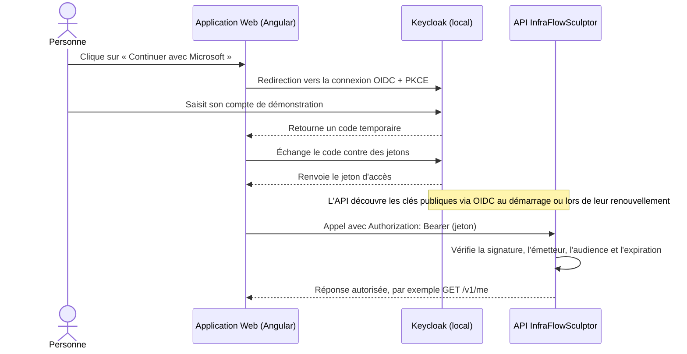

# REX débutant — Keycloak en local avec Aspire

> Ce document explique pourquoi InfraFlowSculptor utilise Keycloak en développement, comment le démarrer et comment s'en servir. Il part de zéro et décrit le dépôt tel qu'il est configuré aujourd'hui.
>
> **En une phrase :** Keycloak fournit une connexion locale de test selon le protocole OpenID Connect ; Aspire le démarre avec l'application. En Azure, InfraFlowSculptor utilise Microsoft Entra ID.

## 1. Le problème que l'on voulait résoudre

Une application doit souvent savoir **qui est connecté** avant de répondre à une requête. Elle doit aussi décider si cette personne a le droit de faire l'action demandée.

Pour développer cette partie avec Entra ID directement, il faudrait notamment un tenant de développement, une inscription d'application, des URI de retour correctes et des comptes de test. Il deviendrait aussi moins simple de fabriquer à volonté des personnes de plusieurs organisations, avec des rôles différents ou une adresse e-mail non vérifiée.

Le projet a donc besoin d'un fournisseur d'identité local, reproductible et pilotable. C'est le rôle de Keycloak ici : il crée des comptes et des jetons de test que l'application consomme par OpenID Connect (OIDC), le même protocole standard que l'application utilise avec son fournisseur configuré en Azure.

### Ce que Keycloak apporte à l'équipe

- Se connecter en local sans compte Microsoft ni tenant Entra de développement.
- Tester des profils connus et réutilisables : Alice, Bob, Chloé, David, Nina et le compte `ops`.
- Vérifier des cas difficiles à préparer dans un tenant partagé : deux organisations, différents rôles et e-mail non vérifié.
- Faire tourner Aspire, l'API et l'interface ensemble sur un poste de développement.
- Garder une configuration d'identité versionnée dans le dépôt, plutôt que de recréer les clients à la main à chaque poste.

## 2. Keycloak, en langage simple

Keycloak est un serveur qui gère des comptes et répond à la question « cette personne s'est-elle connectée ? ». Il peut aussi émettre un jeton contenant des informations utiles à l'application.

Dans cette architecture :

- **Keycloak** est le fournisseur d'identité local.
- **L'application Web** demande à Keycloak de connecter la personne.
- **L'API** vérifie le jeton présenté par l'application Web avant de répondre.
- **Aspire** orchestre les conteneurs et les processus locaux ; il démarre Keycloak avec les autres ressources du projet.

Keycloak est un vrai serveur d'identité exécuté dans un conteneur local. Il permet de tester des parcours OIDC semblables à ceux de l'application avec Entra. Il ne reproduit pas les fonctions propres à Entra telles que Conditional Access, la fédération d'entreprise ou toutes les règles de sécurité d'un tenant.

### Les mots à connaître

| Mot | Explication courte | Dans ce dépôt |
|---|---|---|
| **Authentification** | Vérifier qui est la personne. | Keycloak vérifie le compte de démonstration. |
| **Autorisation** | Décider ce que cette personne a le droit de faire. | L'API vérifie les rôles et les règles métier. |
| **OIDC** | Protocole standard pour connecter une personne à une application. | Le Web et l'API s'appuient sur OIDC. |
| **Royaume** (*realm*) | Espace Keycloak qui contient ses comptes et réglages. | Le royaume de développement s'appelle `ifs`. |
| **Client** | Application déclarée auprès de Keycloak. | `ifs-web` représente le Web ; `ifs-api` identifie l'API ; `ifs-scalar` sert à l'interface de test API. |
| **ID token** | Indique à l'application cliente quelle personne vient de se connecter. | Utilisé par le flux OIDC côté Web. |
| **Jeton d'accès** (*access token*) | Billet numérique temporaire présenté à l'API. | Le navigateur le transmet dans `Authorization: Bearer …`. |
| **Revendication** (*claim*) | Information inscrite dans un jeton. | `oid`, `tid`, `email`, `email_verified`, `name`, `roles` et `amr`. |
| **Émetteur** (*issuer*) | Adresse du serveur qui a créé le jeton. | `https://localhost:8080/realms/ifs`. |
| **Audience** (*audience*) | Destinataire attendu du jeton. | `ifs-api`. |
| **PKCE** | Protection du code temporaire échangé pendant une connexion Web. | Le client `ifs-web` l'impose avec la méthode `S256`. |

## 3. Comment une connexion se déroule

La page de connexion ressemble à une page de l'application, mais le mot de passe est saisi sur Keycloak. L'application ne reçoit pas ce mot de passe.



En pratique, l'API ne demande pas le mot de passe à Keycloak pour chaque appel. Elle vérifie le jeton à l'aide des informations publiques exposées par Keycloak. Si l'émetteur, l'audience, la signature ou la date d'expiration ne conviennent pas, la requête protégée est refusée.

Un jeton d'accès n'est pas un mot de passe chiffré. Dans ce projet, il s'agit d'un jeton signé dont le contenu peut être décodé pour le diagnostic ; la signature permet à l'API de détecter une modification. Il ne faut donc jamais y placer un secret.

La connexion du navigateur utilise le **flux Authorization Code avec PKCE**. Le navigateur revient d'abord avec un code temporaire, puis l'échange contre les jetons. PKCE lie cet échange à la demande initiale. C'est le flux défini par OIDC et utilisé par le client public du projet.

Dans les réponses OIDC, l'**ID token** renseigne le client Web sur la connexion. L'**access token** autorise l'appel aux routes API protégées. L'application envoie donc le second à `/v1/me`, et l'API le vérifie avant de répondre.

## 4. Le choix fait pour InfraFlowSculptor

La [décision DT-07](01-decisions.md#dt-07--authentification--oidc-entra-en-azure-keycloak-en-local) sépare les environnements :

| Environnement | Fournisseur d'identité | Raison |
|---|---|---|
| Développement local | Keycloak | Comptes jetables et maîtrisés ; aucune dépendance à un tenant Entra. |
| Azure | Microsoft Entra ID | Comptes Microsoft et identité réelle des utilisateurs. |
| Tests automatisés | Jetons de test générés pour l'environnement `Testing` | Tests rapides et isolés ; Keycloak n'est pas démarré par l'AppHost de test. |

Le code de l'API choisit son fournisseur à partir de `Auth:Provider`. Dans la configuration locale, Aspire fournit `Keycloak`, l'adresse de l'émetteur et l'audience `ifs-api`. L'API garde ainsi une validation de jeton fondée sur OIDC, sans embarquer les comptes ni les mots de passe de Keycloak.

### Est-ce que je garde le SDK Azure d'authentification ?

**Oui pour les appels de l'application vers Azure ; non comme mécanisme de connexion Keycloak des utilisateurs.** Le dépôt a deux flux d'identité indépendants :

| Besoin | Bibliothèque du dépôt | Identité vérifiée / utilisée |
|---|---|---|
| Le navigateur connecte une personne à IFS | `angular-auth-oidc-client` | Keycloak local ou Entra, selon la configuration OIDC à l'exécution. |
| L'API valide le jeton utilisateur local | `Microsoft.AspNetCore.Authentication.JwtBearer` | Jeton OIDC émis par Keycloak. |
| L'API valide le jeton utilisateur dans Azure | `Microsoft.Identity.Web` | Jeton Microsoft Entra. |
| Le backend appelle Blob, Service Bus ou Redis dans Azure | `Azure.Identity` via `IfsAzureCredential`, puis le SDK propre au service | Identité managée de l'application, indépendante de l'utilisateur connecté. |

`Microsoft.Identity.Web` est conçu pour intégrer ASP.NET Core à la plateforme d'identité Microsoft. Dans cette solution, on ne lui demande donc pas de comprendre Keycloak : la branche Keycloak configure le middleware standard `JwtBearer` avec `Authority` et `Audience`, tandis que la branche Entra appelle `AddMicrosoftIdentityWebApi`.

Le branchement réel dans [`AuthenticationSetup.cs`](../../src/backend/InfraFlowSculptor.Api/Authentication/AuthenticationSetup.cs) ressemble à ceci :

```csharp
if (authOptions.Provider == AuthProvider.Keycloak)
{
    authentication.AddJwtBearer(Schemes.Oidc, options =>
        ConfigureJwt(options, authOptions, environment));
}
else if (authOptions.Provider == AuthProvider.Entra)
{
    authentication.AddMicrosoftIdentityWebApi(authSection, Schemes.Oidc);
}
```

`ConfigureJwt` donne au gestionnaire OIDC l'autorité Keycloak et l'audience `ifs-api`. Les valeurs viennent de `AuthOptions`, injectées par Aspire localement ou par la configuration Azure au déploiement.

`Azure.Identity` sert à obtenir un jeton Microsoft Entra pour qu'un processus de l'application ait accès à une ressource Azure. Il ne valide pas le jeton Keycloak présenté par Alice au endpoint `/v1/me`. En développement, Aspire relie les SDK à des émulateurs locaux par des chaînes de connexion ; en Azure, les ressources configurées par endpoint utilisent l'identité managée. Ces mécanismes peuvent rester dans la même solution, car ils répondent à deux questions différentes : « qui utilise IFS ? » et « avec quelle identité IFS appelle Azure ? ».

Dans le code, [`IfsAzureCredential`](../../src/backend/InfraFlowSculptor.Infrastructure/Azure/IfsAzureCredential.cs) utilise `ManagedIdentityCredential` si l'application dispose de `IDENTITY_ENDPOINT`, sinon `DefaultAzureCredential` pour le développement. [`AzureConnectionResolver`](../../src/backend/InfraFlowSculptor.Infrastructure/Azure/AzureConnectionResolver.cs) choisit une chaîne de connexion locale ou un endpoint Azure avec `TokenCredential`, et [`AzureClientRegistrationExtensions`](../../src/backend/InfraFlowSculptor.Infrastructure/Azure/AzureClientRegistrationExtensions.cs) construit les clients Blob et Service Bus correspondants.

Il n'y a pas non plus d'adaptateur Keycloak spécifique dans le navigateur : le projet utilise une bibliothèque OIDC Angular générique, et lui donne l'adresse de l'autorité Keycloak ou Entra à l'exécution.

## 5. Où la configuration vit

La source à regarder en premier est [`ifs-realm.json`](../../src/backend/InfraFlowSculptor.AppHost/Realms/ifs-realm.json). Elle décrit le royaume `ifs` :

- le client Web `ifs-web`, ses redirections vers `http://localhost:4200` et PKCE `S256` ;
- le client d'audience API `ifs-api` ;
- le client `ifs-scalar` pour tester l'API ;
- les utilisateurs de démonstration, leurs attributs, leurs rôles et leurs mots de passe locaux ;
- les *mappers*, c'est-à-dire les règles qui placent les attributs et rôles utiles dans les jetons.

L'AppHost est dans [`Program.cs`](../../src/backend/InfraFlowSculptor.AppHost/Program.cs). Il ajoute Keycloak sur le port fixe `8080`, donne à Aspire le mot de passe administrateur sous forme de paramètre secret, attache un volume local, importe les fichiers du dossier `Realms`, puis fait attendre l'API et le Web jusqu'à ce que Keycloak soit disponible.

L'API lit et valide sa configuration dans [`AuthenticationSetup.cs`](../../src/backend/InfraFlowSculptor.Api/Authentication/AuthenticationSetup.cs) et [`AuthOptions.cs`](../../src/backend/InfraFlowSculptor.Api/Authentication/AuthOptions.cs). La version du paquet Aspire Keycloak est épinglée dans [`Directory.Packages.props`](../../src/backend/Directory.Packages.props).

### Parcours de code complet, du démarrage à `/v1/me`

1. **Aspire choisit le fournisseur local et démarre Keycloak.** Dans [`AppHost/Program.cs`](../../src/backend/InfraFlowSculptor.AppHost/Program.cs), le projet fournit à l'API `Auth__Provider=Keycloak`, `Auth__Authority=https://localhost:8080/realms/ifs` et `Auth__Audience=ifs-api`. Il crée Keycloak avec un paramètre secret, lui attache un volume persistant en développement et importe `Realms/ifs-realm.json`. `WithReference` et `WaitFor` relient l'API au service et attendent sa disponibilité.

2. **Le royaume décrit ce que Keycloak doit émettre.** [`ifs-realm.json`](../../src/backend/InfraFlowSculptor.AppHost/Realms/ifs-realm.json) configure le client public `ifs-web`, le flux de code, PKCE `S256`, les redirections Web, le client d'audience `ifs-api` et les mappers. Ces mappers ajoutent par exemple `oid`, `tid`, `email_verified` et les rôles aux jetons. Le fichier contient aussi les utilisateurs de démonstration et le client `ifs-scalar`. En développement, [`Api/Program.cs`](../../src/backend/InfraFlowSculptor.Api/Program.cs) configure Scalar pour le flux Authorization Code + PKCE afin de tester une route protégée depuis la documentation de l'API.

3. **Aspire transmet la configuration OIDC au Web.** L'AppHost fournit `IFS_OIDC_PROVIDER`, `IFS_OIDC_AUTHORITY`, `IFS_OIDC_CLIENT_ID` et `IFS_OIDC_SCOPE`. Le script [`write-config.mjs`](../../src/frontend/ifs-web/scripts/write-config.mjs) les écrit dans `public/config.json` au démarrage. `provideAppConfig` rend cette configuration disponible au reste de l'application.

4. **Angular démarre le client OIDC générique.** [`oidc.providers.ts`](../../src/frontend/ifs-web/src/app/core/auth/oidc.providers.ts) lit le même `config.json` et configure `angular-auth-oidc-client` (dépendance dans [`package.json`](../../src/frontend/ifs-web/package.json)) : `responseType: 'code'`, URL de redirection égale à l'origine du Web, scopes et renouvellement de session. Il lit la configuration via `HttpBackend`, sans passer par les intercepteurs HTTP qui sont en train d'être configurés. Pour Entra, le fichier fournit un endpoint de découverte et le paramètre `select_account` spécifiques ; pour Keycloak, il se sert de la découverte OIDC standard de l'autorité configurée. [`app.config.ts`](../../src/frontend/ifs-web/src/app/app.config.ts) enregistre ce fournisseur et les intercepteurs HTTP.

5. **Le clic déclenche la redirection ; l'intercepteur apporte ensuite le jeton.** [`login.ts`](../../src/frontend/ifs-web/src/app/features/auth/login/login.ts) appelle `OidcSecurityService.authorize()`. Le libellé du bouton est commun aux environnements ; c'est l'autorité runtime qui décide si la page de connexion est celle de Keycloak ou d'Entra. `withAppInitializerAuthCheck()` vérifie l'état OIDC pendant le démarrage et [`authenticated.guard.ts`](../../src/frontend/ifs-web/src/app/core/auth/authenticated.guard.ts) renvoie vers `/login` si une route protégée est visitée sans session. L'intercepteur OIDC n'ajoute le jeton qu'aux requêtes reconnues comme API et limitées à la route `/v1/` (`secureRoutes` dans `oidc.providers.ts` et `isApiRequest`). Les fichiers de l'interface, comme `/config.json`, ne reçoivent pas le bearer token.

6. **L'API sélectionne son validateur et protège les routes.** [`DependencyInjection.cs`](../../src/backend/InfraFlowSculptor.Api/DependencyInjection.cs) enregistre l'authentification et une politique par défaut qui exige un utilisateur authentifié. Dans [`AuthenticationSetup.cs`](../../src/backend/InfraFlowSculptor.Api/Authentication/AuthenticationSetup.cs), `Auth:Provider=Keycloak` choisit `AddJwtBearer` et donne à la validation l'autorité et l'audience ; `Auth:Provider=Entra` choisit `AddMicrosoftIdentityWebApi`. Le middleware lit les métadonnées OIDC et les clés publiques du fournisseur, puis valide signature, émetteur, audience et expiration. `MapInboundClaims=false` garde les noms de revendications (`oid`, `tid`, `roles`, `name`) tels quels. Les versions NuGet sont gérées dans [`Directory.Packages.props`](../../src/backend/Directory.Packages.props) ; il épingle notamment `Microsoft.AspNetCore.Authentication.JwtBearer`, `Microsoft.Identity.Web` et `Azure.Identity`.

   Le schéma commun `Bearer` a aussi un aiguillage pour les futurs jetons d'API dont la valeur commence par `ifs_`. Ces jetons vont vers le schéma distinct `ApiToken` ; les jetons utilisateur Keycloak et Entra vont vers le schéma OIDC. Ce chemin `ApiToken` est indépendant de Keycloak, et son gestionnaire ne valide pas encore de jetons : il renvoie actuellement `NoResult`.

   Dans l'environnement `Testing`, un autre chemin prioritaire valide des jetons signés par une clé de test. Cette clé est explicitement interdite hors de `Testing`, ce qui permet aux tests API de tourner sans démarrer Keycloak ni utiliser un tenant Entra.

7. **L'identité devient un objet métier commun.** [`HttpCurrentUser.cs`](../../src/backend/InfraFlowSculptor.Infrastructure/Authentication/HttpCurrentUser.cs) extrait `tid` et `oid` dans `ICurrentUser`. [`VerifiedEmailResolver.cs`](../../src/backend/InfraFlowSculptor.Infrastructure/Authentication/VerifiedEmailResolver.cs) normalise la notion d'adresse vérifiée malgré les revendications différentes de Keycloak (`email_verified`) et d'Entra (`xms_edov` ou tenant de comptes personnels). [`MeController.cs`](../../src/backend/InfraFlowSculptor.Api/Controllers/MeController.cs) expose ces informations sur `GET /v1/me` et exige la politique `Member`.

8. **Les tests isolent chaque niveau.** [`MeEndpointTests.cs`](../../src/backend/tests/InfraFlowSculptor.Api.Tests/Common/MeEndpointTests.cs) vérifie `/v1/me` avec des jetons de test signés : appel sans jeton (`401`), identité Alice et adresse de Nina non vérifiée. Les tests API ne nécessitent donc pas un conteneur Keycloak. Le parcours navigateur réel avec Keycloak est exercé par les scénarios E2E de la solution.

Le choix entre OIDC utilisateur et identité Azure des services n'est donc pas un `if` dans chaque endpoint. Il se fait aux points de branchement : configuration d'authentification dans l'API, autorité OIDC fournie au Web, et `AzureConnectionResolver` pour choisir chaîne de connexion locale ou endpoint Azure avec `TokenCredential`.

**Le fichier JSON est une source d'initialisation.** Le volume conserve l'état du royaume. Si Keycloak a déjà créé le royaume, modifier `ifs-realm.json` ne remplace pas automatiquement les données déjà enregistrées.

## 6. Démarrer Keycloak dans ce dépôt

Le projet est déjà câblé. Il n'est pas nécessaire de créer un conteneur Keycloak séparément.

### Prérequis

- Windows et PowerShell 7, conformément aux consignes du dépôt.
- Docker Desktop démarré.
- Le SDK .NET et la CLI Aspire installés.
- Les secrets de développement Aspire disponibles sur le poste ; ils ne sont pas versionnés.

À la racine du dépôt, vérifier les prérequis :

```powershell
pwsh tools/dev/check-prereqs.ps1
```

Puis lancer Aspire depuis `src/backend` :

```powershell
Set-Location src/backend
# Une seule fois par poste, choisir un mot de passe local pour la console Keycloak :
aspire secret set Parameters:keycloak-admin-password "votre-mot-de-passe-local"
aspire start
```

Remplacer `votre-mot-de-passe-local` par une valeur choisie pour ce poste. Aspire la garde dans les User Secrets de l'AppHost, hors du dépôt. Si Aspire demande aussi le paramètre secret de PostgreSQL au premier démarrage, lui fournir une valeur locale ou suivre sa demande.

Attendre que la ressource `keycloak`, puis `api` et `web`, soient démarrées dans le tableau de bord Aspire. Le tableau de bord donne accès aux états et aux journaux. Les adresses importantes sont :

| Usage | Adresse |
|---|---|
| Application Web | `http://localhost:4200` |
| Console d'administration Keycloak | `https://localhost:8080/admin` |
| Royaume de connexion | `https://localhost:8080/realms/ifs` |
| API | port HTTP `5257` ou HTTPS `7246` selon le profil .NET |

Les détails de démarrage d'Aspire et des autres émulateurs sont dans [05 — Exécution locale](05-execution-locale.md). Pour arrêter les ressources gérées par Aspire, lancer `aspire stop` depuis `src/backend`.

### Ce qui se passe au démarrage

1. Aspire démarre les conteneurs et processus locaux du projet.
2. Le conteneur Keycloak initialise son royaume depuis `Realms/ifs-realm.json` quand le royaume n'existe pas encore.
3. Le Web reçoit l'adresse d'autorité `https://localhost:8080/realms/ifs` et le client `ifs-web`.
4. L'API démarre avec `Auth:Provider=Keycloak`, cette même adresse d'autorité et `Auth:Audience=ifs-api`.
5. Aspire attend Keycloak avant de considérer le Web et l'API prêts.

## 7. Se connecter et essayer les scénarios

1. Ouvrir `http://localhost:4200`.
2. Cliquer sur le bouton de connexion. Son libellé mentionne Microsoft, mais en local la configuration Aspire redirige vers Keycloak.
3. Sur la page Keycloak, saisir un compte de démonstration.
4. Revenir dans InfraFlowSculptor et vérifier que l'application est connectée.

Le mot de passe commun aux comptes de démonstration est `Ifs-Demo-2026!`. Ces identifiants sont volontairement publics et réservés au développement local. Ne les réutiliser pour aucun compte réel.

| Compte | Cas à essayer |
|---|---|
| `alice@contoso.example` | Compte standard de l'organisation Contoso. |
| `bob@contoso.example` | Contributeur Contoso ; utilisé dans le parcours de connexion du Web. |
| `chloe@contoso.example` | Lectrice Contoso. |
| `david@fabrikam.example` | Compte d'une autre organisation ; pratique pour tester l'isolation. |
| `emma@outlook.example` | Simule un compte Microsoft personnel. |
| `nina@contoso.example` | Adresse non vérifiée ; utile pour vérifier les règles qui exigent une adresse vérifiée. |
| `ops@ifs.example` | Compte opérateur avec des rôles internes et un indicateur MFA simulé. |

Un test simple consiste à se connecter comme Alice, puis à vérifier `GET /v1/me` : la réponse de l'API doit correspondre à l'identité du jeton. Se déconnecter et essayer David ou Nina permet de voir que deux identités du même royaume peuvent porter des attributs différents.

### Tester plusieurs personnes

Keycloak conserve une session de navigateur sous forme de cookie. Pour comparer deux comptes sans que la session du premier soit réutilisée, ouvrir une fenêtre privée distincte ou un profil de navigateur séparé par personne. La déconnexion d'IFS ferme la session applicative ; pour fermer aussi la session Keycloak, utiliser *Sign out* dans la console de compte Keycloak.

### Consulter les rôles et les jetons

- Dans la console Keycloak, choisir le royaume `ifs`, puis *Clients* → `ifs-web` → *Client scopes* → *Evaluate*. Choisir un utilisateur et regarder le jeton généré.
- Un jeton d'accès contient des données encodées et signées. Le décoder localement aide au diagnostic, mais **ne pas le coller dans un décodeur public en ligne**.
- Pour un refus `401`, comparer l'émetteur et l'audience attendus avec les valeurs dans les journaux Aspire et le jeton de test.

### Ajouter un utilisateur de test

Pour un essai temporaire, créer un utilisateur dans la console d'administration en ayant sélectionné le royaume `ifs` (et non `master`). Définir son e-mail, son mot de passe, son état « e-mail vérifié » et les rôles utiles. L'application Web utilise une session en ligne et ne demande pas `offline_access` par défaut. N'attribuer le rôle de royaume intégré `offline_access` qu'à un compte utilisé par un client qui doit agir après la déconnexion.

Les utilisateurs récurrents doivent aussi être ajoutés à `ifs-realm.json` pour que l'équipe puisse les recréer de façon déterministe. Dans ce projet, les attributs `oid` et `tid` sont importants : ils simulent respectivement l'identifiant de l'utilisateur et celui du tenant. L'API ne peut pas déduire ces valeurs du seul nom de connexion.

## 8. Ajouter cette approche à un autre AppHost Aspire

Le dépôt offre déjà l'exemple complet. Pour transposer l'approche dans un autre projet, les pièces à prévoir sont les suivantes :

1. **Ajouter l'intégration Aspire Keycloak** et épingler sa version comme les autres dépendances du projet.
2. **Créer un royaume JSON** avec les clients, URI de redirection, utilisateurs de test et mappers adaptés.
3. **Ajouter Keycloak à l'AppHost** avec un port stable, un mot de passe admin injecté comme paramètre secret, un volume si l'état local doit survivre aux arrêts et un import du dossier de royaume.
4. **Configurer l'application cliente** avec son identifiant public, les URL de redirection exactes, OIDC Authorization Code et PKCE.
5. **Configurer l'API** avec l'émetteur attendu (`Authority`) et son audience (`Audience`), puis protéger les routes qui exigent une identité.
6. **Faire attendre les dépendances** : le Web et l'API doivent attendre que Keycloak soit disponible.
7. **Valider les cas utiles** : connexion, déconnexion, expiration, utilisateur absent, rôle absent, émetteur ou audience incorrecte.

Dans ce dépôt, ces opérations sont déjà réalisées dans [`AppHost/Program.cs`](../../src/backend/InfraFlowSculptor.AppHost/Program.cs), [`ifs-realm.json`](../../src/backend/InfraFlowSculptor.AppHost/Realms/ifs-realm.json) et le code d'authentification de l'API. Le guide technique [09 — Keycloak](09-keycloak.md) décrit les réglages précis, l'ajout d'un utilisateur, la modification des rôles, la remise à zéro et le dépannage.

Voici la forme simplifiée de l'enregistrement Keycloak côté AppHost. Le projet ajoute en plus des durées de vie contrôlées par sa configuration et ses ressources de développement :

```csharp
var adminPassword = builder.AddParameter("keycloak-admin-password", secret: true);
var keycloak = builder
    .AddKeycloak("keycloak", port: 8080, adminPassword: adminPassword)
    .WithDataVolume()
    .WithRealmImport("./Realms");

var api = builder.AddProject<Projects.InfraFlowSculptor_Api>("api")
    .WithReference(keycloak)
    .WaitFor(keycloak)
    .WithEnvironment("Auth__Provider", "Keycloak")
    .WithEnvironment("Auth__Authority", "https://localhost:8080/realms/ifs")
    .WithEnvironment("Auth__Audience", "ifs-api");
```

Le client public du Web se configure dans le fichier de royaume. Les quelques propriétés essentielles sont :

```json
{
  "clientId": "ifs-web",
  "publicClient": true,
  "standardFlowEnabled": true,
  "directAccessGrantsEnabled": false,
  "attributes": { "pkce.code.challenge.method": "S256" },
  "redirectUris": ["http://localhost:4200/*"]
}
```

Ce sont des extraits pour comprendre le montage ; les fichiers complets du dépôt restent la référence pour le nom exact des ressources, les scopes et les autres réglages.

Pour transposer la configuration, garder les adresses alignées. Le client doit autoriser l'URL exacte de retour du Web, et l'API doit attendre le même émetteur que celui inscrit dans le jeton. Changer le port, le nom du royaume ou le schéma `https` modifie l'émetteur et peut transformer chaque appel protégé en `401`.

## 9. Les limites et les coûts d'exploitation

### Ce que le projet gagne

- Les développeurs disposent de scénarios prévisibles sans dépendre d'un tenant externe.
- Les comptes de test peuvent couvrir plusieurs tenants simulés, plusieurs rôles et des e-mails vérifiés ou non.
- Aspire rassemble le démarrage, les journaux et les états des ressources locales.
- Le JSON du royaume rend la configuration relisible et réutilisable sur un poste neuf.

### Ce que l'équipe doit entretenir

- **Deux fournisseurs à comprendre.** Keycloak et Entra supportent OIDC, mais leurs options d'administration et leurs fonctions spécifiques diffèrent. Un parcours réussi localement ne prouve pas à lui seul qu'il fonctionne dans Entra.
- **Des différences d'identité.** Les claims ou rôles configurés dans le JSON doivent correspondre à ce que l'API attend. Les mappers Keycloak sont une source d'erreurs supplémentaire.
- **Un état persistant parfois surprenant.** Le volume Docker garde un ancien royaume. Une modification JSON n'est pas forcément visible après redémarrage.
- **Des ports et URL liés entre eux.** Les URI de redirection, l'autorité, le certificat local et l'émetteur doivent rester cohérents.
- **Un service local de plus.** Keycloak et Docker consomment des ressources et peuvent ralentir le premier démarrage à froid.
- **Une dépendance d'intégration en préversion dans ce dépôt.** Le paquet `Aspire.Hosting.Keycloak` actuellement épinglé est `13.5.3-preview.1.26425.3`. Une préversion peut évoluer ou présenter des bords moins stabilisés qu'une version finale.
- **Des comptes publics.** Les identifiants de démonstration sont visibles dans le dépôt. C'est acceptable pour les données jetables locales et interdit pour un environnement accessible au public.

L'import Aspire `WithRealmImport` est prévu pour le développement local. La documentation Aspire indique que ce mécanisme d'injection de fichiers n'est pas pris en charge par `aspire publish` ou `aspire deploy`. Le royaume de production doit donc être livré et initialisé selon le mécanisme choisi pour le déploiement, sans réutiliser les utilisateurs ni les mots de passe de développement.

## 10. Retours d'expérience pratiques

### Ce qui a déjà été vérifié dans le projet

Les validations consignées pendant l'intégration montrent que le royaume importé émet les revendications attendues pour Alice et Nina. Le parcours Authorization Code + PKCE a été exercé via Scalar ; l'API renvoie `verifiedEmail: null` pour Nina, dont l'adresse est volontairement non vérifiée, et répond `401` à `/v1/me` sans jeton. Le parcours Web a ensuite été vérifié avec Bob : connexion, appel `/v1/me`, déconnexion et conservation de la session après rechargement.

1. **Commencer par le flux complet, avec un seul utilisateur.** Vérifier login → retour au Web → appel `/v1/me` avant de construire des scénarios de rôle compliqués.
2. **Traiter l'issuer comme une adresse contractuelle.** Ici, `https://localhost:8080/realms/ifs` doit rester identique entre le jeton et la configuration de validation de l'API.
3. **Versionner le royaume, garder le volume à l'esprit.** JSON = configuration de départ ; volume = état actuel. Pour corriger un royaume persistant, faire une modification ciblée dans la console ou l'API d'administration et reporter la modification dans le JSON.
4. **Ne pas effacer un volume pour une petite correction.** Sa suppression supprime comptes, mots de passe, sessions et personnalisations locales. Le guide [09 — Keycloak](09-keycloak.md) détaille comment repartir de zéro ou réparer l'accès administrateur.
5. **Tester les différences avec Entra avant livraison.** Entra reste le fournisseur Azure : les essais d'intégration dans un environnement Entra sont nécessaires pour les politiques et configurations propres à Microsoft.
6. **Garder les mots de passe hors du code applicatif.** Le mot de passe administrateur est fourni à Aspire comme secret local. Les mots de passe de démonstration, eux, sont publics par conception et ne servent qu'aux tests locaux.

## 11. Dépannage rapide

| Symptôme | Première vérification |
|---|---|
| La page Web ne rejoint pas Keycloak | Vérifier que `keycloak` est sain dans Aspire et que le port `8080` est disponible. |
| « Invalid redirect URI » | Vérifier que le Web utilise `http://localhost:4200` et que cette adresse figure dans les redirections du client `ifs-web`. |
| `401` sur tous les appels API | Comparer le `Authority` à l'émetteur exact du jeton : schéma HTTPS, port `8080` et royaume `ifs`. Vérifier aussi l'audience `ifs-api`. |
| L'utilisateur ou son rôle manque | Vérifier que le navigateur utilise le royaume `ifs`, puis les attributs, les mappers et les rôles du client concerné. |
| La modification du JSON n'apparaît pas | Le volume contient probablement déjà le royaume. Appliquer la correction ciblée dans la console ou l'Admin REST API, puis la reporter dans le JSON. |
| `invalid_grant` dans la console administrateur | Le volume persistant peut conserver un mot de passe admin antérieur. Suivre la procédure de récupération du [guide technique](09-keycloak.md#8-récupérer-laccès-administrateur-invalid_grant) sans supprimer le volume. |

## 12. Pour continuer

- [Guide technique Keycloak du dépôt](09-keycloak.md) — console, comptes, rôles, remise à zéro et dépannage complet.
- [Exécution locale avec Aspire](05-execution-locale.md) — ressources locales, commandes et ports.
- [Décision DT-07](01-decisions.md#dt-07--authentification--oidc-entra-en-azure-keycloak-en-local) — pourquoi le projet utilise Keycloak localement et Entra dans Azure.
- [OpenID Connect Core 1.0](https://openid.net/specs/openid-connect-core-1_0.html) — protocole d'authentification basé sur OAuth 2.0.
- [RFC 7636 — PKCE](https://www.rfc-editor.org/rfc/rfc7636.html) — protection de l'échange de code pour les clients publics.
- [Guide d'administration Keycloak](https://www.keycloak.org/docs/latest/server_admin/) — royaumes, clients, utilisateurs et rôles.
- [Adaptateur JavaScript Keycloak](https://www.keycloak.org/securing-apps/javascript-adapter) — Authorization Code et PKCE côté navigateur.
- [Intégration Keycloak pour Aspire](https://aspire.dev/integrations/security/keycloak/) — démarrer Keycloak et importer un royaume depuis un AppHost.
- [Secrets Aspire](https://aspire.dev/reference/cli/commands/aspire-secret/) — gérer localement les paramètres secrets de l'AppHost.
- [Microsoft.Identity.Web](https://learn.microsoft.com/entra/msal/dotnet/microsoft-identity-web/) — intégration ASP.NET Core avec la plateforme d'identité Microsoft.
- [Azure Identity](https://learn.microsoft.com/dotnet/azure/sdk/authentication/) — authentifier le backend auprès des ressources Azure.
- [JWT bearer dans ASP.NET Core](https://learn.microsoft.com/aspnet/core/security/authentication/configure-jwt-bearer-authentication?view=aspnetcore-10.0) — validation standard par émetteur et audience.
