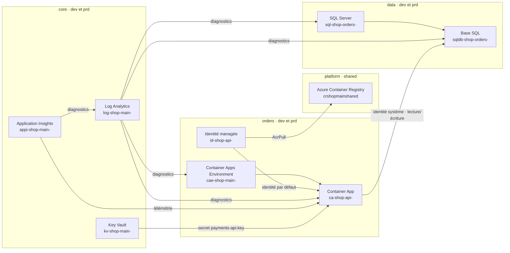

<!-- Généré par InfraFlowSculptor — projet shop. Ne pas modifier : la prochaine publication remplacera ce fichier. Personnalisation : voir les points d’extension ci-dessous. -->

# Architecture IFS — shop

Cette destination contient l’infrastructure Bicep et les pipelines Azure DevOps du projet `shop`. Les cibles `dev` et `prd` sont déployées séparément. La cible `shared` héberge le registre d’images commun.

## Composants et liaisons

Les ressources des composants `core`, `data` et `orders` existent dans `dev` et `prd`. Les ressources de `platform` sont dans `shared`. Les liaisons vers le registre et la base SQL traversent les composants et les abonnements prévus par la cible.

## Noms Azure par cible

| Ressource | `dev` | `prd` | `shared` |
|---|---|---|---|
| Groupe `core / main` | `rg-shop-core-main-dev` | `rg-shop-core-main-prd` | — |
| Log Analytics `core / log main` | `log-shop-main-dev` | `log-shop-main-prd` | — |
| Application Insights `core / appi main` | `appi-shop-main-dev` | `appi-shop-main-prd` | — |
| Key Vault `core / kv main` | `kv-shop-main-dev` | `kv-shop-main-prd` | — |
| Groupe `data / main` | `rg-shop-data-main-dev` | `rg-shop-data-main-prd` | — |
| SQL Server `data / sql orders` | `sql-shop-orders-dev` | `sql-shop-orders-prd` | — |
| Base `data / sqldb orders` | `sqldb-shop-orders-dev` | `sqldb-shop-orders-prd` | — |
| Groupe `platform / main` | — | — | `rg-shop-platform-main-shared` |
| Registre `platform / cr main` | — | — | `crshopmainshared` |
| Groupe `orders / main` | `rg-shop-orders-main-dev` | `rg-shop-orders-main-prd` | — |
| Identité `orders / id api` | `id-shop-api-dev` | `id-shop-api-prd` | — |
| Environnement Container Apps `orders / cae main` | `cae-shop-main-dev` | `cae-shop-main-prd` | — |
| Container App `orders / ca api` | `ca-shop-api-dev` | `ca-shop-api-prd` | — |

Les noms globaux peuvent déjà exister dans Azure. Pour une preuve, remplacez `shop` par un code disponible partout, puis reportez-le dans les fichiers de release. Les abonnements de démonstration `A`, `B` et `C` doivent aussi être remplacés par de vrais GUID.

## Ordre de déploiement

1. `core` : journalisation, télémétrie et Key Vault.
2. `data` : SQL Server et base, avec diagnostic vers Log Analytics.
3. `platform` : registre partagé ; il n’a pas de dépendance d’infrastructure.
4. `orders` : environnement Container Apps et API ; dépend de `core`, `data` et `platform`.

Déployez les composants dans cet ordre pour chaque environnement. Le pipeline de release séquence les cibles `dev` puis `prd` pour les composants qui déclarent cette dépendance. `prd` et `shared` sont protégés par approbation.

## Paramètres et rôles

| Élément | Destination ou portée | Source |
|---|---|---|
| `Sql__Server` | Configuration de `ca api` | Nom DNS de `sql-shop-orders-<cible>` |
| `Sql__Database` | Configuration de `ca api` | `sqldb-shop-orders-<cible>` |
| `LogAnalytics__WorkspaceId` | Configuration de `ca api` | Sortie `customerId` de `log-shop-main-<cible>` |
| `APPLICATIONINSIGHTS_CONNECTION_STRING` | Configuration de `ca api` | Connexion de `appi-shop-main-<cible>` |
| `AZURE_CLIENT_ID` | Configuration de `ca api` | Identité managée `id-shop-api-<cible>` |
| `Payments__ApiKey` | Secret `payments-api-key` de Key Vault | Variable secrète `MAIN_PAYMENTS_API_KEY` du groupe `ifs-shop-<cible>` ; aucune valeur secrète n’est publiée ici |

| Principal | Rôle | Portée |
|---|---|---|
| Identité de déploiement `id-ifs-deploy-shop-<cible>` | Contributor, Azure Deployment Stack Owner et Role Based Access Control Administrator avec condition limitée aux rôles du pilote | Abonnement de la cible |
| Identité `id-shop-api-<cible>` | AcrPull | Registre partagé `crshopmainshared` |
| Identité `id-shop-api-<cible>` | Key Vault Secrets User | Key Vault de la cible |
| Identité `id-shop-api-<cible>` | Log Analytics Reader | Workspace de la cible |
| Identité système de `ca-shop-api-<cible>` | `db_datareader`, `db_datawriter` | Base SQL de la cible |

L’identité applicative n’a pas de rôle au niveau de l’abonnement. Les attributions applicatives sont limitées aux ressources indiquées.

## Installation, release et retour arrière

1. Suivez [`.ifs/install/SETUP.md`](.ifs/install/SETUP.md) pour les prérequis, la préparation Azure, le pipeline d’installation et la saisie des secrets.
2. Remplacez les espaces réservés des fichiers `release.*.json` et fournissez un manifeste `.ifs/manifest.json` correspondant à la révision publiée.
3. Dans Azure DevOps, exécutez les pipelines de release d’infrastructure dans l’ordre des composants ci-dessus. Examinez l’aperçu `what-if` et son empreinte avant d’approuver une application.
4. Pour revenir sur l’infrastructure, restaurez le modèle souhaité, générez et publiez une nouvelle révision, puis examinez et déployez le plan de retour. Certaines propriétés ne peuvent être annulées automatiquement ; le plan les signale. IFS ne restaure pas les données : utilisez les sauvegardes du client.
5. Pour revenir sur l’application, relancez la release de l’image précédente. Le retour du code applicatif ne restaure pas les données ni l’infrastructure.

## Point d’extension Bicep

Le pilote n’ajoute pas de fichier d’extension client. Le contrat disponible pour une extension Bicep est versionné `v1` : un module de portée abonnement est appelé après les ressources du composant et reçoit les mêmes données dans tous les langages :

- `target` : code de cible, abonnement et région ;
- `resourceGroups` : nom Azure de chaque groupe de ressources, par nom logique ;
- `resources` : nom Azure et identifiant de chaque ressource présente, par nom logique ;
- `tags` : tags effectifs du composant.

L’extension appartient au dépôt client et reste hors des fichiers gérés. À la publication, IFS vérifie qu’elle existe dans la branche cible ; si elle manque, la publication de cette destination est refusée et un modèle vide est proposé. N’ajoutez pas de ressource directement à un fichier généré : faites évoluer le modèle IFS ou utilisez ce contrat.
